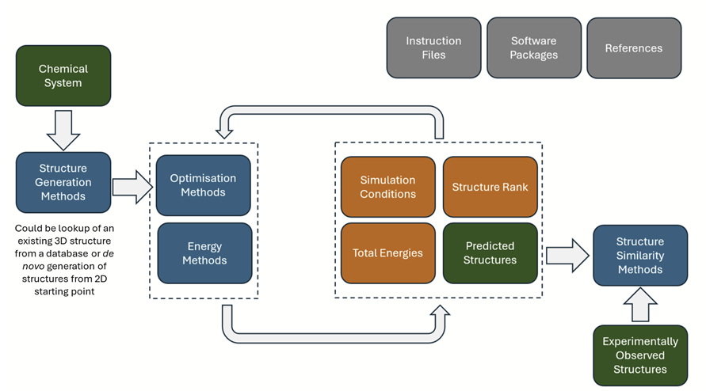

# Crystal Structure Prediction Dictionary

## Description

This is a hub for information relating to the development of CIF dictionaries for describing predicted crystal
structures and the methods, parameters and workflows used to calculate these.
This project aims to standardise the description of crystal structure prediction (CSP) methodologies and their resulting
energy landscapes.
By providing a common framework, we facilitate the sharing, comparison, and analysis of CSP results across different
research groups and methods.

## Repository Structure

This repository is organised into:

1. `Dictionaries/` This folder contains the core dictionaries that define the terminology and data fields used to
   describe CSP methodologies and their outputs.

    * `CSPCore`: The central dictionary for this project. It provides detailed descriptions for various aspects of a CSP
      study, including:

        * Chemical Inputs: Definitions for describing the molecular and chemical composition of the system.

        * Structure Generation Methods: A breakdown of the algorithms used to generate theoretical crystal structures.

        * High-Level Ranking Methods: Descriptions of the computational methods (e.g., DFT, force fields) used to rank
          and optimise the generated structures.

        * Output Predicted Structures: The standardised format for reporting final predicted structures and their
          associated properties.

    * `DFT`: This directory contains references to TCOD DFT dictionary, which provides detailed descriptions for
      DFT-specific parameters that are used in conjunction with our core dictionary.

    * `Forcefields`: A working draft for a dictionary specifically dedicated to describing force-field-based CSP methods
      in detail. We welcome contributions and feedback on this draft.

2. `SharedLandscapes/` This is the public repository for CSP landscapes submitted by researchers. The data here is
   shared openly to foster collaboration and transparency in the field. Our team will use the dictionaries described
   above to curate your submission and ensure it can be properly described.

## How to Contribute

We encourage the community to contribute to both the dictionaries and the shared landscapes.

* For Dictionaries: If you believe a data field is missing or a description could be improved, please open an issue or
  submit a pull request with your suggested changes. Alternatively, write to .

* For Landscapes: Please follow the submission guidelines to add your CSP landscape to the
  `SharedLandscapes/CONTRIBUTING.md` folder.
